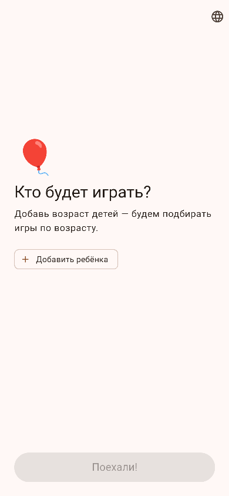
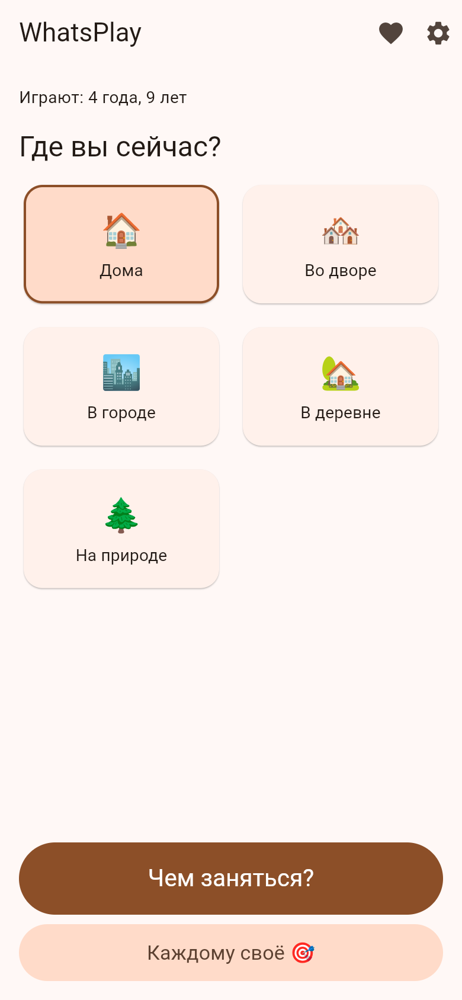
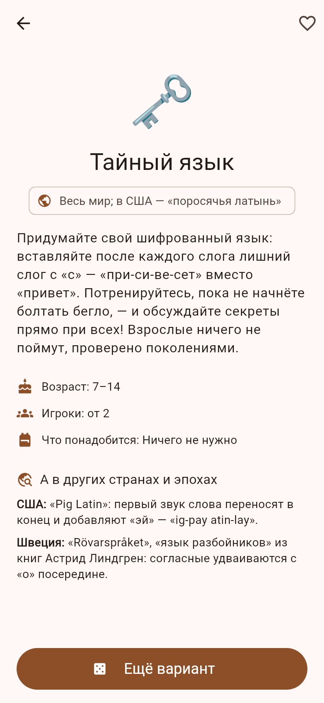
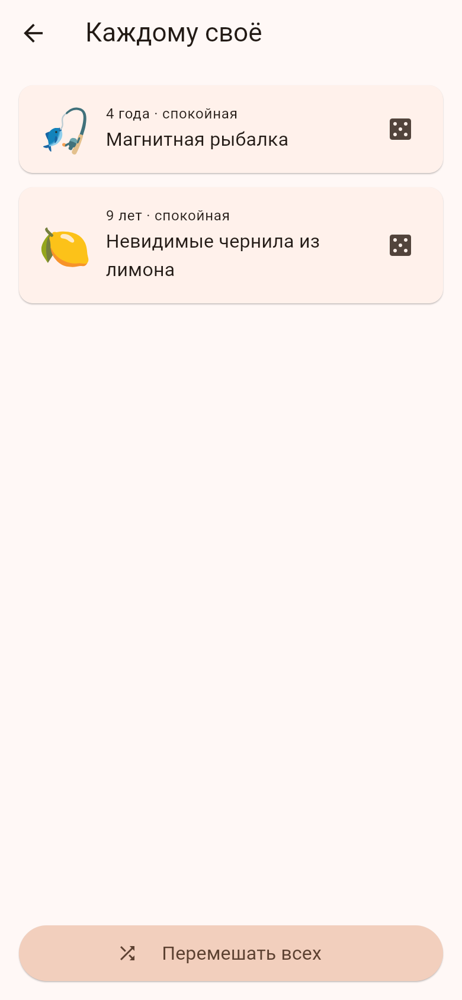

# WhatsPlay 🎈

**Чем занять детей?** Оффлайн-приложение для родителей: укажи возраст детей и где вы сейчас (дом, двор, город, деревня, природа) — получи карточку игры. В базе **232 настоящие игры разных стран и эпох**: от бабок Древней Греции и римской морры до советских «Секретиков» и ганской ампе.

**What shall the kids play?** An offline app for parents: enter your kids' ages and where you are (home, yard, city, village, nature) — get a game card. The database holds **232 real games from different countries and eras**: from Ancient Greek knucklebones and Roman morra to Soviet "sekretiki" and Ghanaian ampe.

<p align="center">
  
</p>

| Главный экран | Карточка игры | Каждому своё |
|:---:|:---:|:---:|
|  |  |  |

## Возможности / Features

- 🎲 Случайная игра под возраст и место / Random game matching age and location
- 🌍 Блок «А в других странах и эпохах» — как в эту же игру играют по всему миру / "Around the world" section on every card
- 🎯 Режим «Каждому своё» — отдельная игра каждому ребёнку / "One for each" mode — a separate solo game per child
- ❤️ Избранное / Favorites
- 🇷🇺🇬🇧 Русский и английский / Russian and English
- 📴 Полностью оффлайн, без рекламы и трекеров / Fully offline, no ads, no trackers

## Скачать / Download

Готовый APK для Android — в разделе [Releases](https://github.com/HippocampusEvolve/WhatsPlay/releases).

Android APK builds are on the [Releases](https://github.com/HippocampusEvolve/WhatsPlay/releases) page.

## Сборка из исходников / Build from source

```bash
flutter pub get
flutter test
flutter build apk --release
```

Требуется Flutter 3.44+. / Requires Flutter 3.44+.

## Структура / Structure

- `assets/activities/activities.json` — база игр (все тексты на русском и английском) / the game database (all texts in Russian and English)
- `lib/` — приложение на Flutter / the Flutter app
- `test/` — тесты валидности базы и логики подбора / database validity and matching-logic tests

Хочешь добавить игру из своего детства? Открой issue или pull request — формат карточки виден в `activities.json`.

Want to add a game from your own childhood? Open an issue or a pull request — the card format is visible in `activities.json`.

## Лицензия / License

[MIT](LICENSE)
